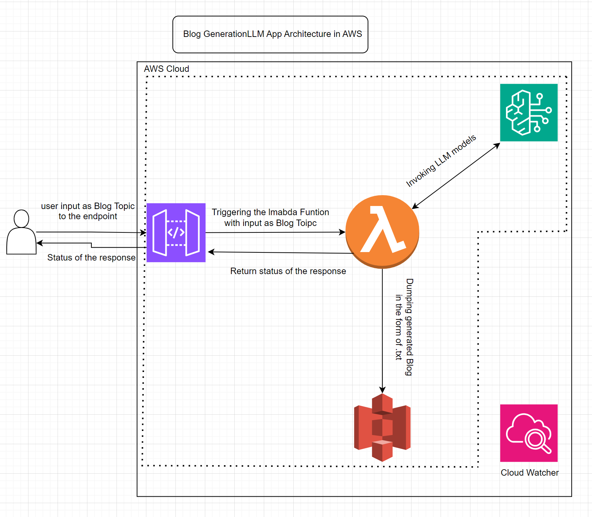

# Blog-generator-app-using-Bedrock

## Introduction :

In today's digital age, content creation is paramount for businesses and individuals alike. However, generating high-quality blog content consistently can be a time-consuming and challenging task. To address this need, we have developed a state-of-the-art Blog Generator API leveraging cutting-edge technology provided by AWS Bedrock. This API allows users to effortlessly generate blog content on any given topic and seamlessly save it to AWS S3 for future use.

### Need of the Project
The need for automated blog generation arises from the ever-increasing demand for fresh and engaging content in various industries. Traditional methods of manual content creation are often inefficient and resource-intensive, leading to delays in publishing schedules and compromising content quality. By harnessing the power of AI and cloud computing, our Blog Generator API streamlines the content creation process, enabling users to generate high-quality blog posts quickly and efficiently.

## Architecture Diagram :



### Deployment
The deployment of our Blog Generator API follows a robust and scalable architecture utilizing AWS services for seamless integration and management. Here's an overview of the deployment process:

1. **Model Integration with AWS Bedrock**: We have integrated our blog generation model with AWS Bedrock, a comprehensive suite of AI services offered by Amazon Web Services. Leveraging the advanced capabilities of AWS Bedrock, our model ensures accurate and contextually relevant blog content generation.

2. **API Gateway Configuration**: AWS API Gateway serves as the entry point for our Blog Generator API, providing a secure and scalable interface for users to submit blog topics and receive generated content. Through API Gateway, users can seamlessly interact with our API without worrying about underlying infrastructure complexities.

3. **AWS Lambda Function**: Upon receiving a request from the API Gateway, AWS Lambda functions are triggered to execute the blog generation process. These serverless functions are highly scalable and cost-effective, ensuring optimal performance even during peak usage periods.

    **Catch**: While deploying the lambda function we have to make sure that the required libraries that are required for the lambda function are available. TO make this avaliable we have add a custom layer by adding .zip fileto the layer. Now to create the zip file we have to use the following command -
    ```bash
    pip install boto3 -t boto3/
    ```
    This will install the boto3 package in the floder named boto3. Then we have to convert this to a .zip file and upload to the layer.

4. **Integration with AWS S3**: The generated blog content is automatically saved to AWS S3, a highly durable and scalable object storage service offered by Amazon Web Services. By storing blog posts in S3, users can access and manage their content securely from anywhere, at any time.

5. **Logging and Monitoring with AWS CloudWatch**: To monitor the performance and activity of our Blog Generator API, we leverage AWS CloudWatch, a comprehensive monitoring and logging service provided by Amazon Web Services. CloudWatch captures logs and metrics related to API requests, Lambda function invocations, and overall system health, allowing us to proactively identify and address any issues.

### Conclusion
Our Blog Generator API represents a significant advancement in automated content creation, empowering businesses and individuals to generate high-quality blog content with ease. By leveraging the power of AI and cloud computing through AWS Bedrock and AWS services, we have created a robust and scalable solution that addresses the growing need for efficient content generation in today's digital landscape. With seamless deployment and integration with AWS infrastructure, our API enables users to streamline their content creation workflows and stay ahead in the competitive online space.


